# Message Diagrams
This file provides a series of example conversations to be used as a reference when implementing the common crate.


## Planet Initialization

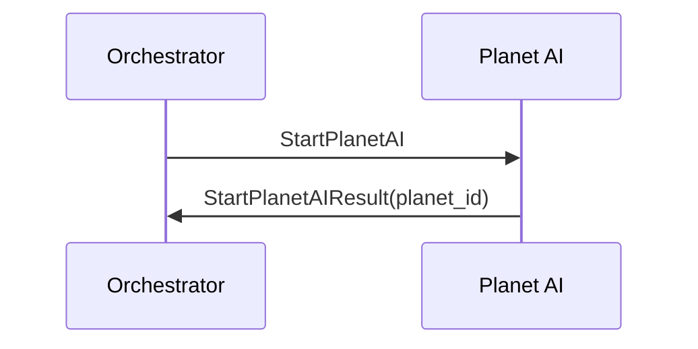

## Planet AI Stop

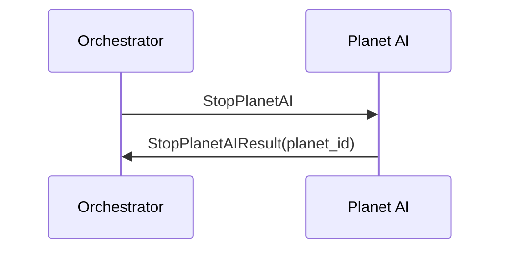

## Sunray Interaction

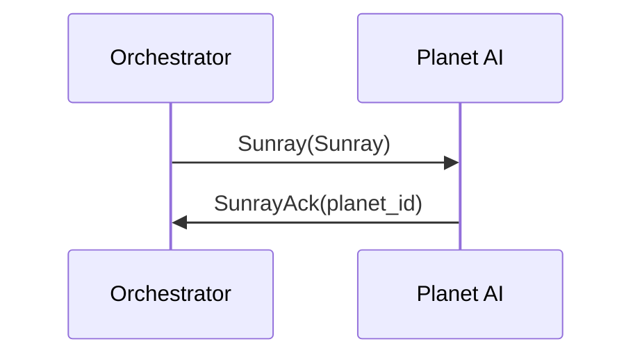

## Planet is Killed
this must always be handled, even if Planet is Stopped

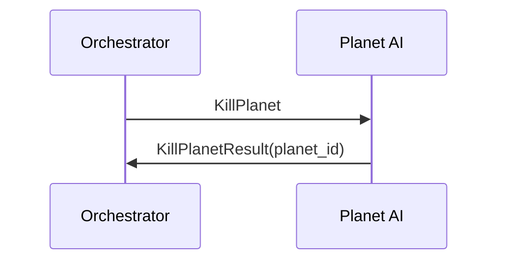

## Asteroid Defense Scenario

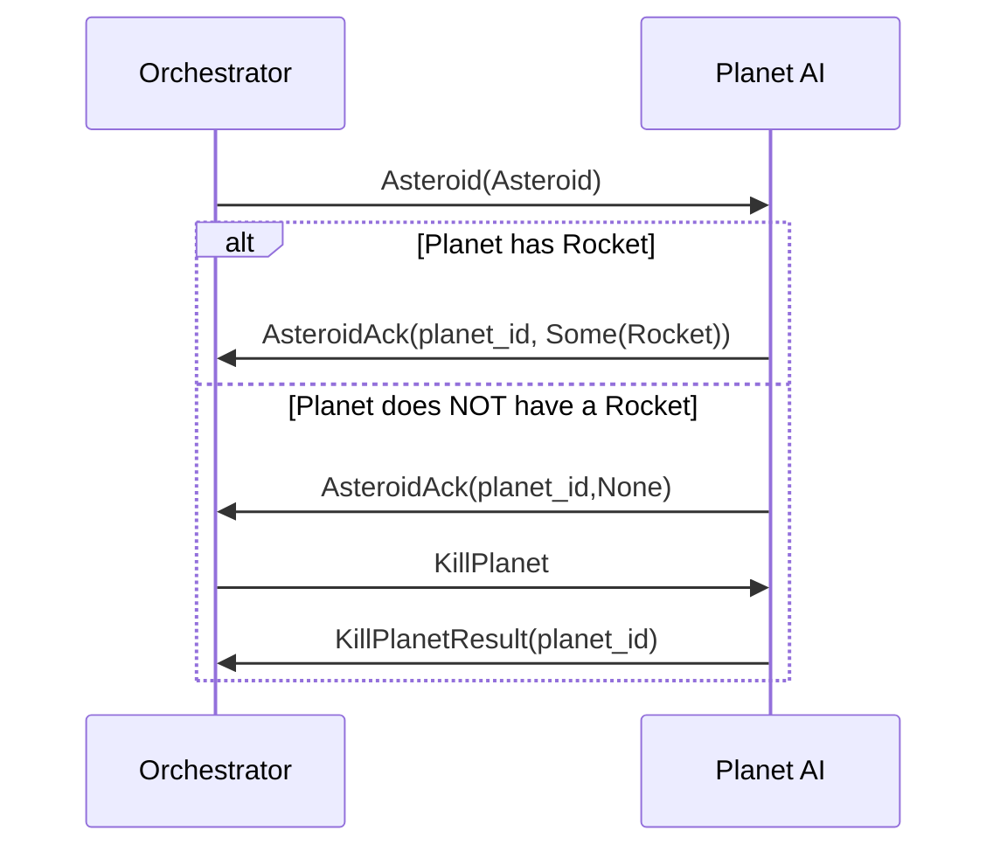

## Internal State Discovery

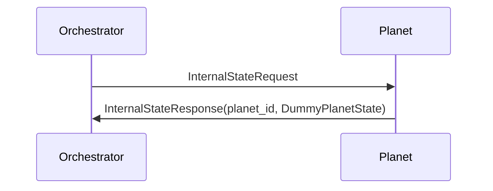

## Explorer Initialization

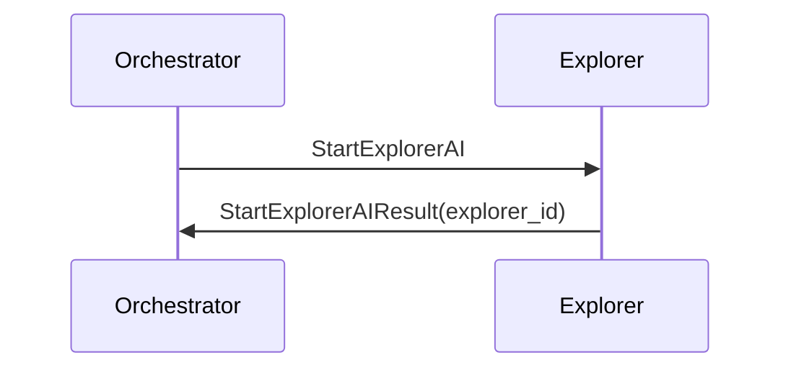

## Reset Explorer

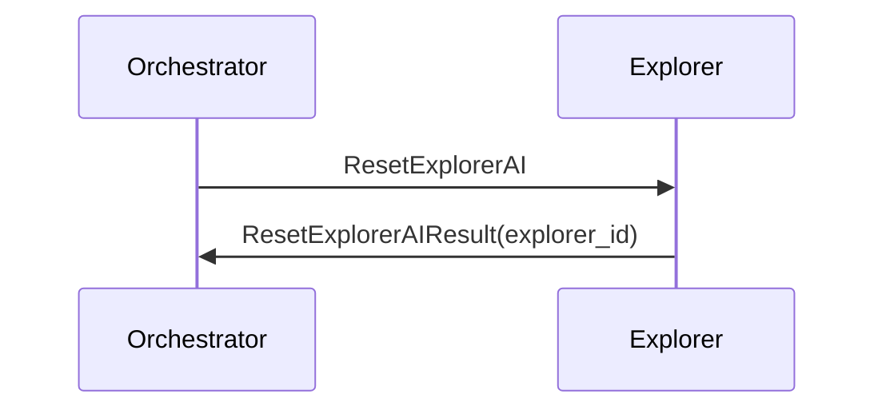
## Stop Explorer

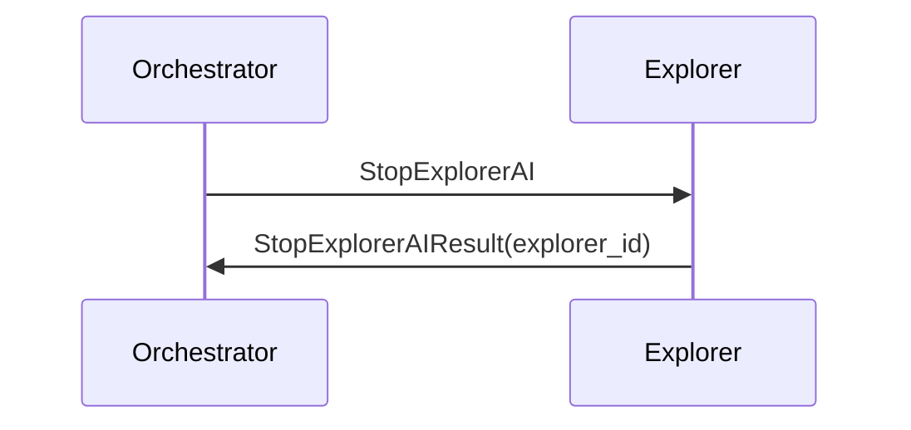

## Neighbors discovery

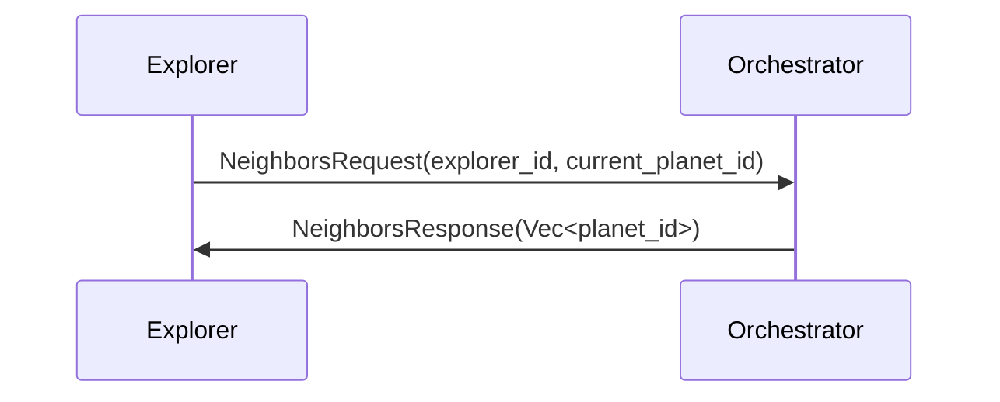

## Moving to another planet (Manually from Orch)

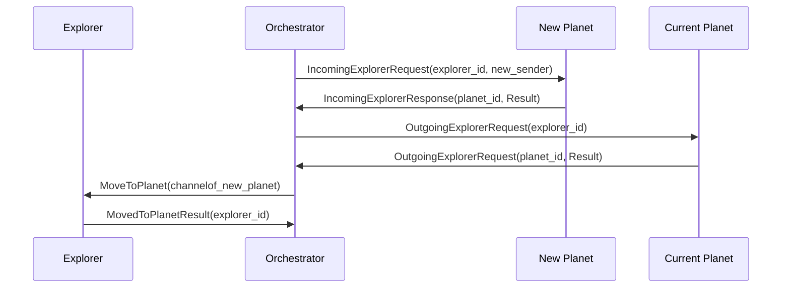

## Moving to another planet (Explorer Asks)

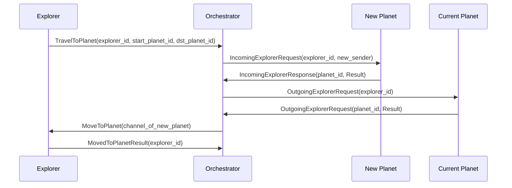
## Bag Content

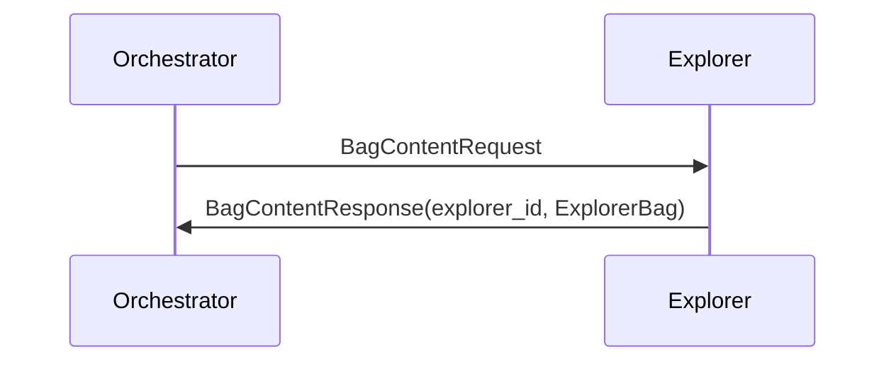

## Basic Resource discovery(manually)
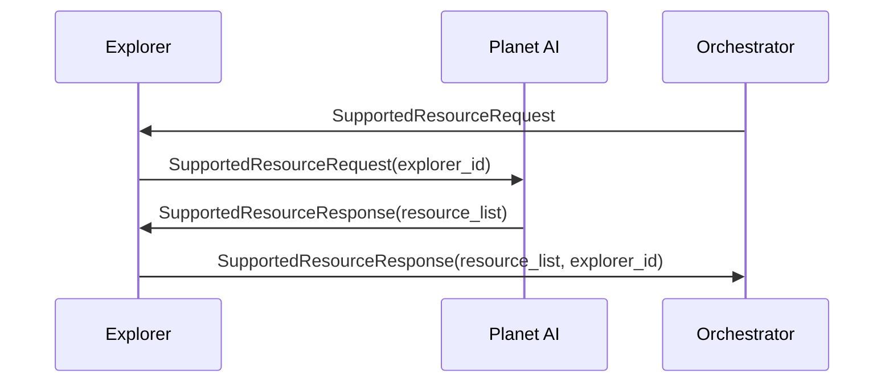
## Combination Rules discovery(manually)
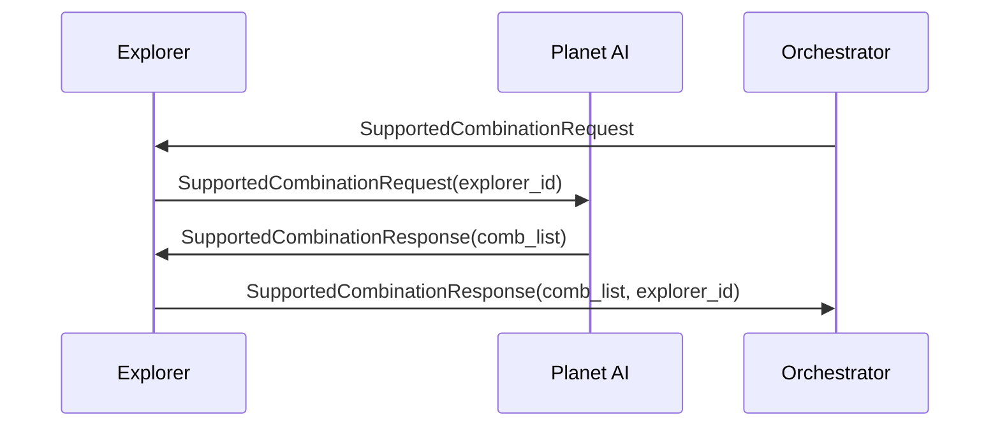
## Basic Resource Generation(manually)
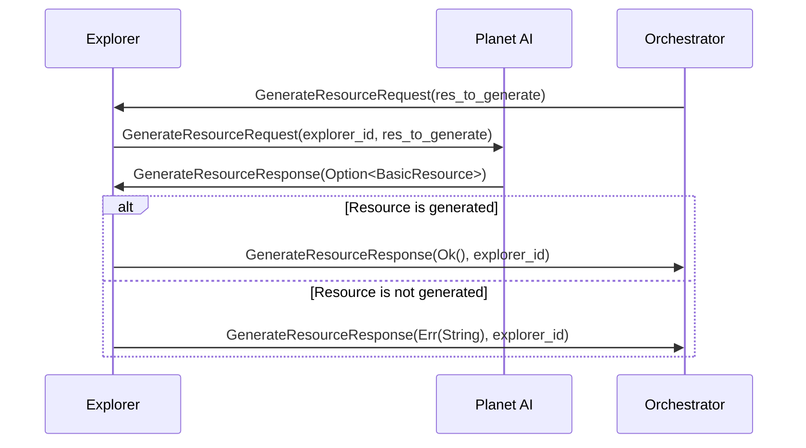

##  Resource Combination(manually)
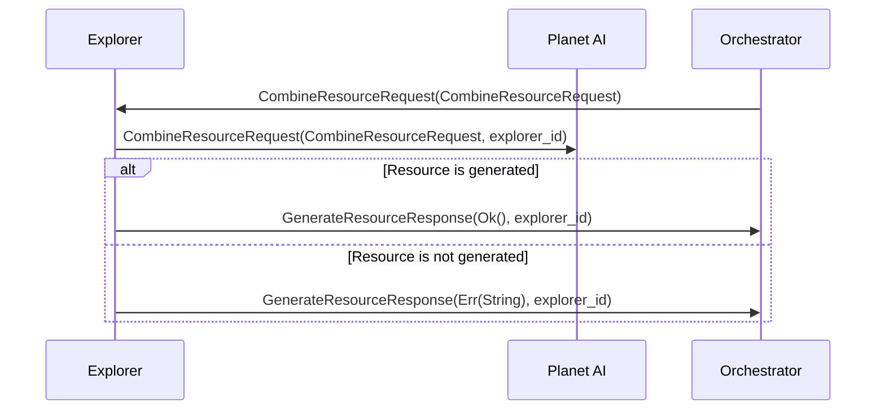

## Basic Resource discovery (from Explorer)

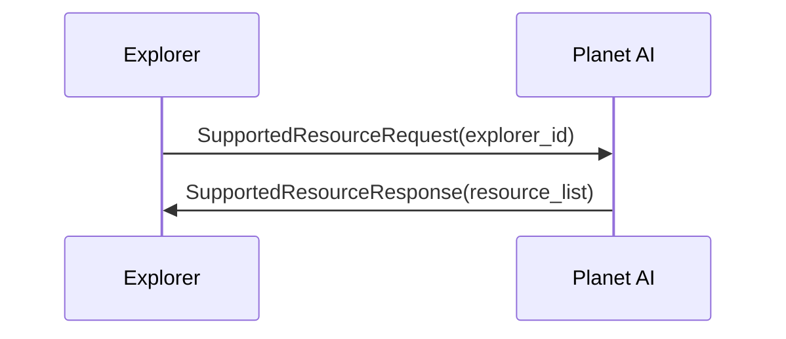

## Combination Rules discovery(from Explorer)
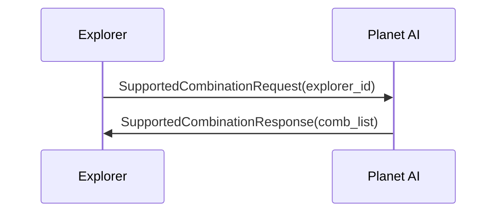

## Basic Resource Generation (from Explorer)
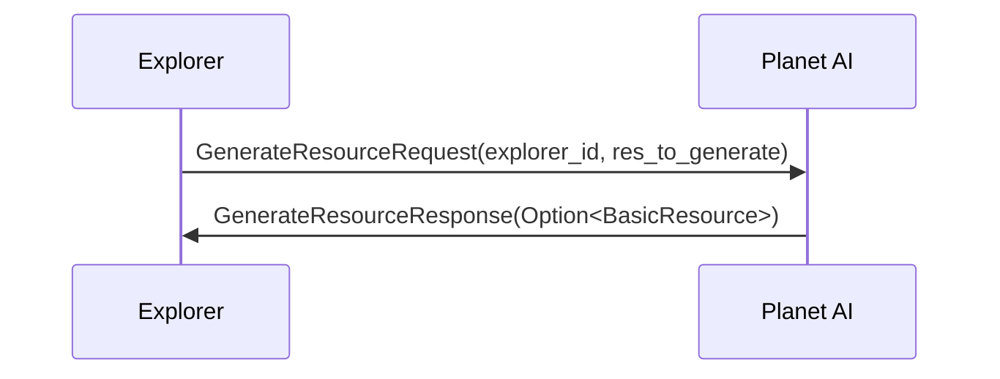


##  Resource Combination(from Explorer)
```mermaid
sequenceDiagram
    participant E as Explorer
    participant P as Planet AI

    E ->> P: CombineResourceRequest(CombineResourceRequest, explorer_id)
    alt Complex Resource is generated
    P ->> E: CombineResourceResponse(Ok(ComplexResource))
    else Complex Resource is not generated
    P ->> E: CombineResourceResponse(Err((String, Resource1, Resource2)))
    end


```

## Energy Cell Availability

```mermaid
sequenceDiagram
    participant E as Explorer
    participant P as Planet AI

    E->>P: AvailableEnergyCellRequest(explorer_id)
    P->>E: AvailableEnergyCellResponse(available_cells_qty)
```


## Internal State Discovery (from Explorer)

```mermaid
sequenceDiagram
    participant E as Explorer
    participant P as Planet

    E->>P: InternalStateRequest(explorer_id)
    P->>E: InternalStateResponse(PlanetState)
```

