## Planet Initialization

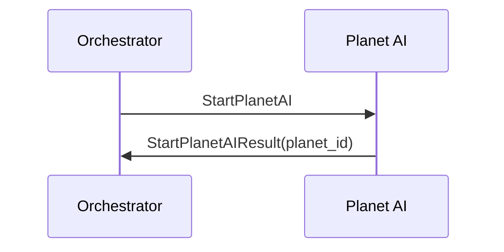

## Planet AI Stop

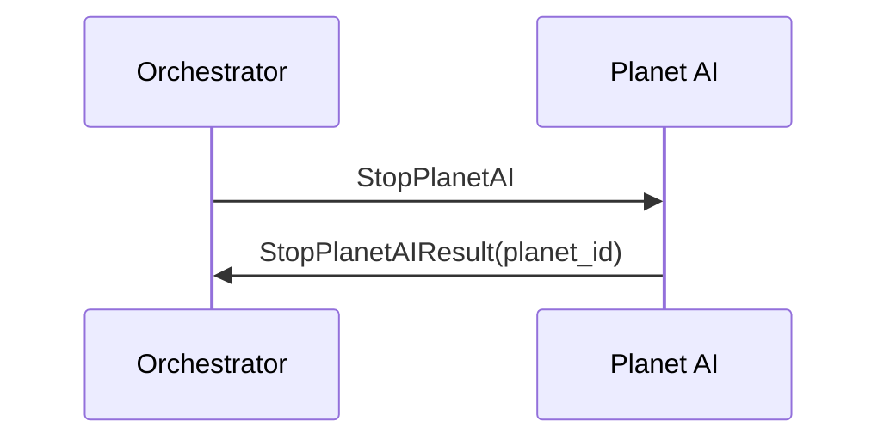

## Sunray Interaction

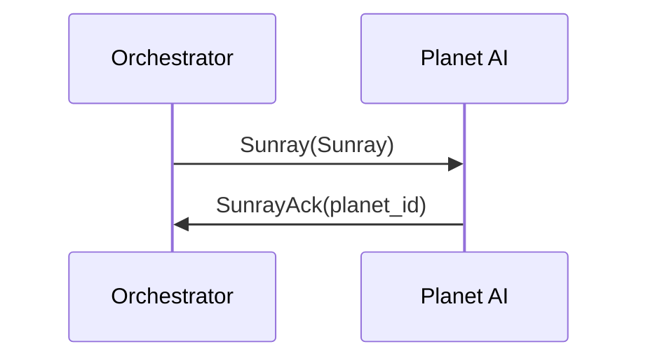

## Asteroid Defense Scenario

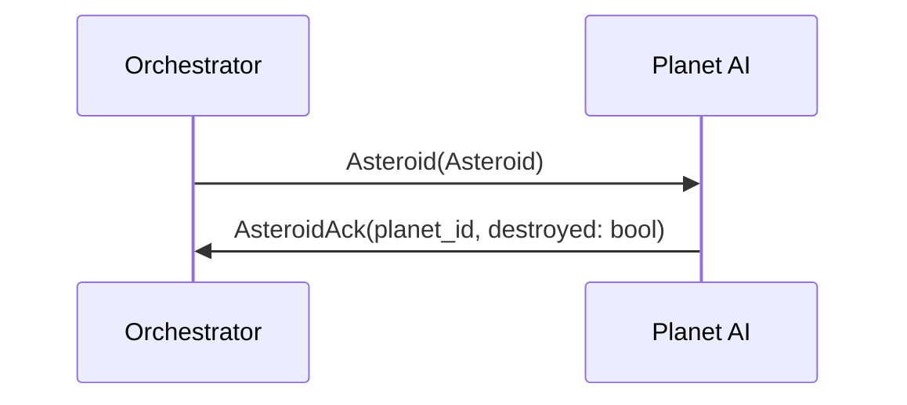

## Internal State Discovery

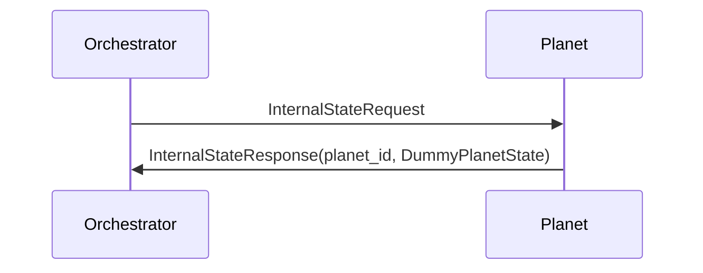

## Explorer Initialization

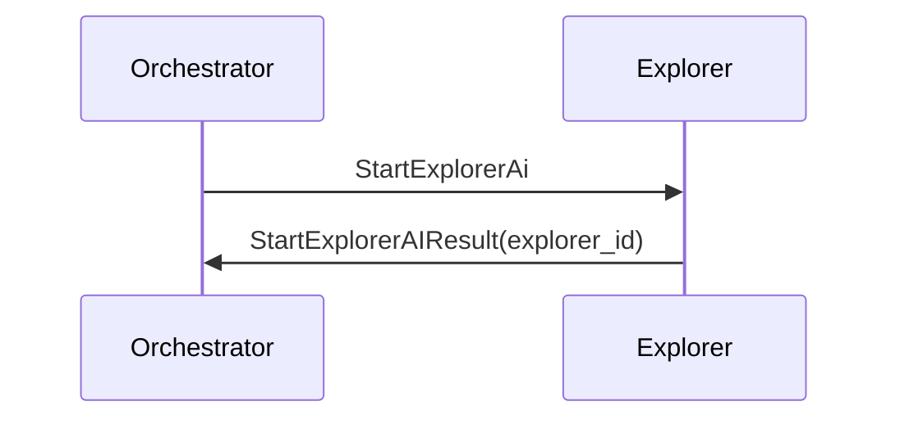

## Stop Explorer

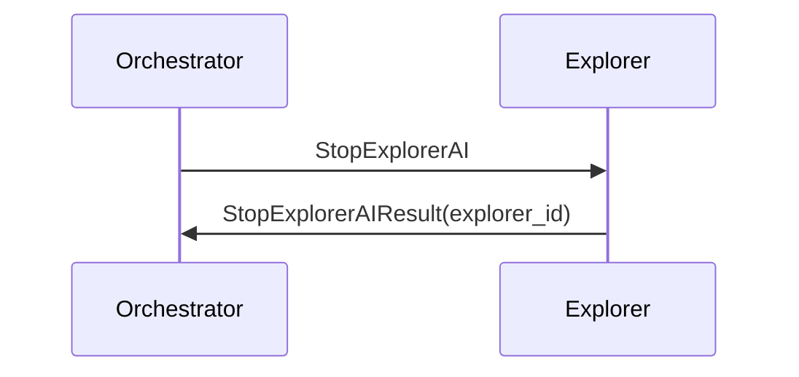

## Neighbors discovery

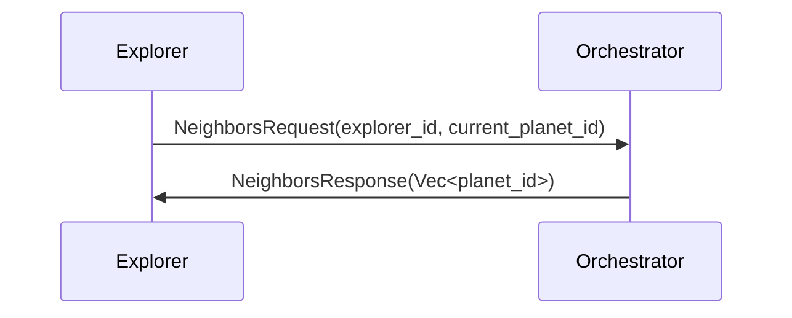

## Moving to another planet (Manually from Orch)

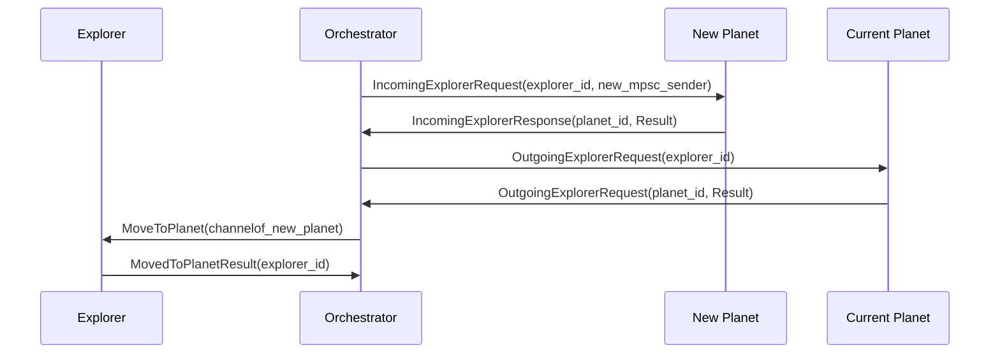

## Moving to another planet (Explorer Asks)

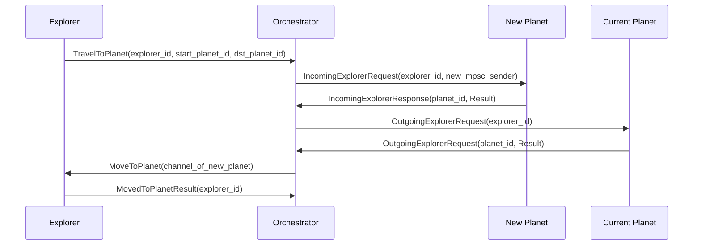
## Bag Content 

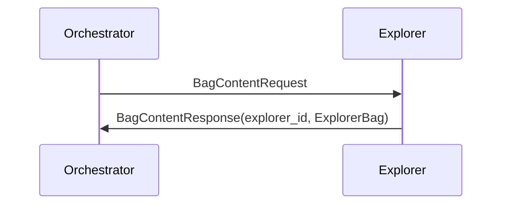

## Basic Resource discovery(manually)
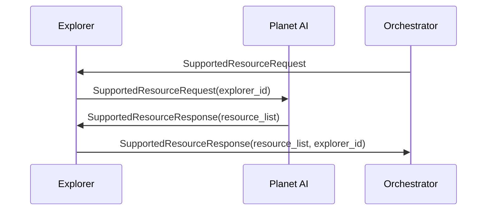
## Combination Rules discovery(manually)
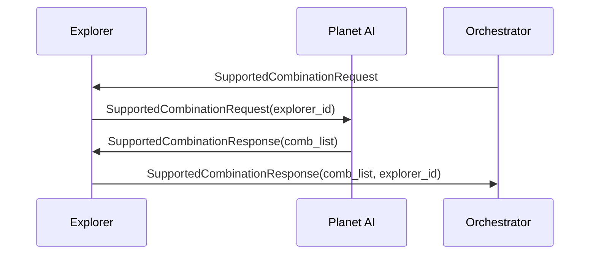
## Basic Resource Generation(manually)
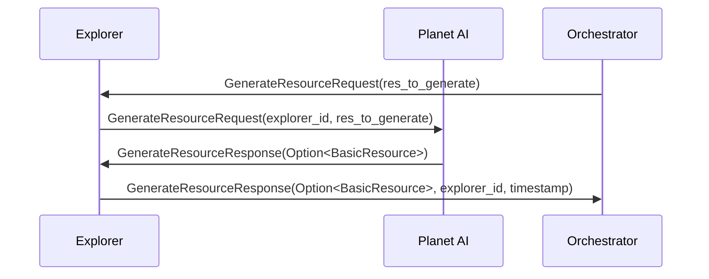

##  Resource Combination(manually)
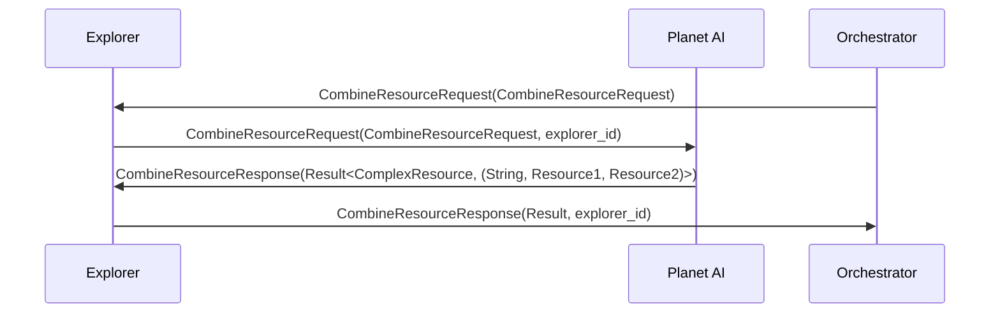

## Basic Resource discovery (from Explorer)

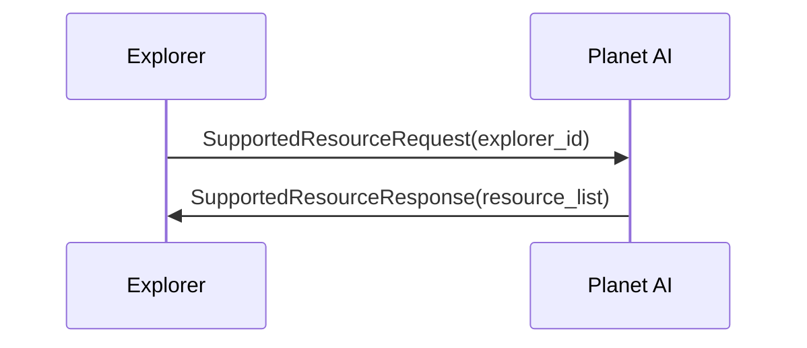

## Combination Rules discovery(from Explorer)
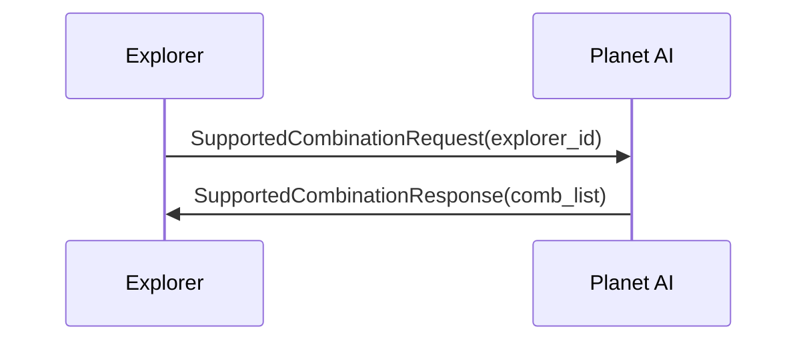

## Basic Resource Generation (from Explorer)
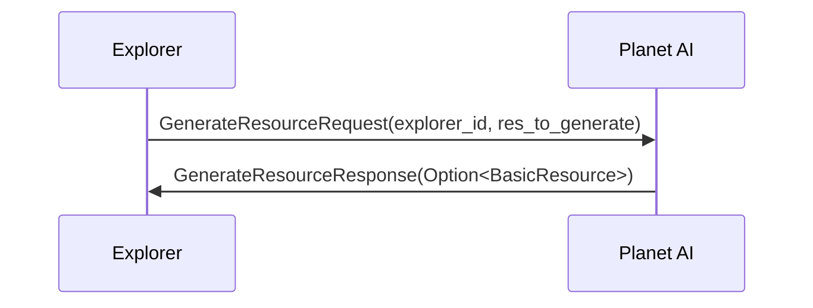


##  Resource Combination(from Explorer)
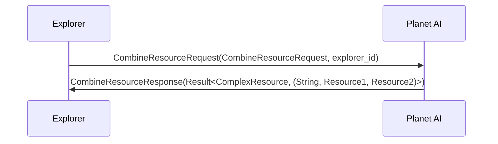

## Energy Cell Availability

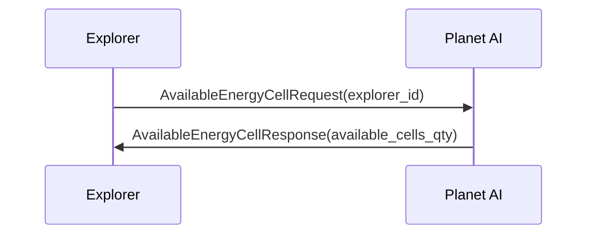


## Internal State Discovery (from Explorer)

```mermaid
sequenceDiagram
    participant E as Explorer
    participant P as Planet

    E->>P: InternalStateRequest(explorer_id)
    P->>E: InternalStateResponse(PlanetState)
```

